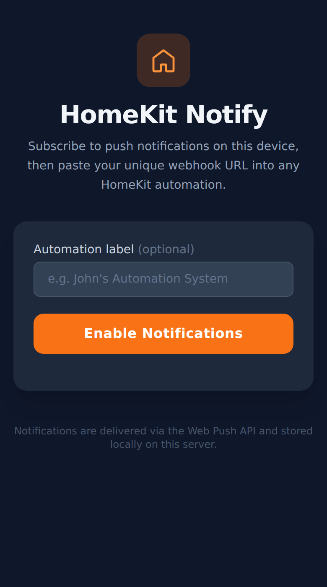
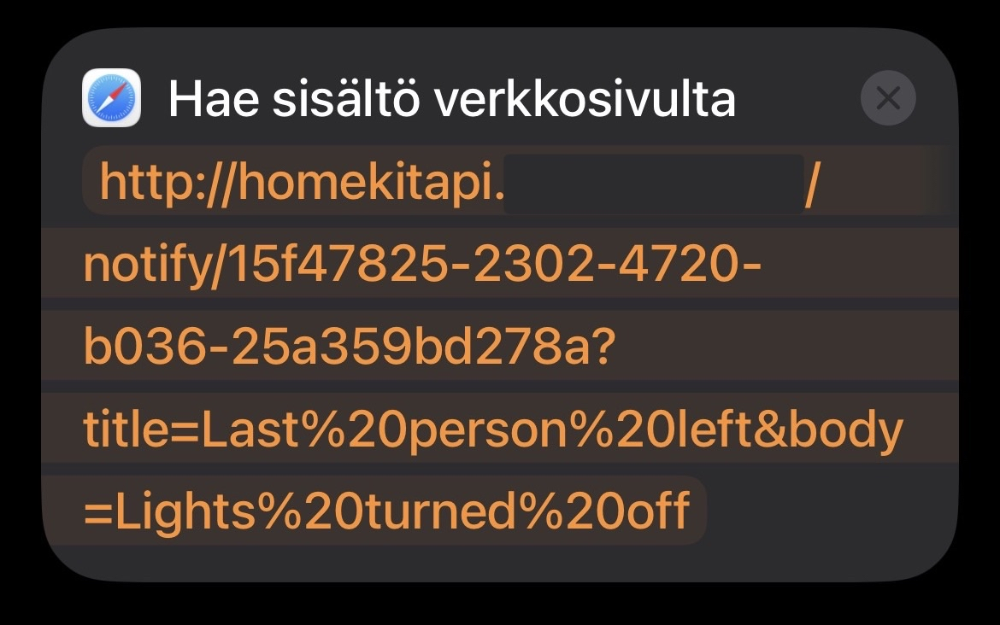
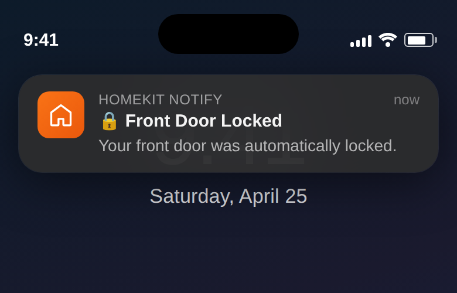

# HomeKit Notify

**HomeKit Notify** is a self-hosted Node.js server that bridges Apple HomeKit automations and Web Push notifications. Open the web app on your iPhone (added to your Home Screen), tap **Enable Notifications**, and you'll receive a unique webhook URL. Paste that URL into any HomeKit automation — or any HTTP-capable tool — and your phone will receive a native push notification every time it's triggered.

---

## Screenshots

<table>
  <tr>
    <td align="center" valign="middle" rowspan="2">
      
    </td>
    <td width="20"></td>
    <td align="left" valign="top">
      
    </td>
  </tr>
  <tr>
        <td width="20"></td>
    <td align="left" valign="bottom">
      
    </td>
  </tr>
</table>

---

## How It Works

1. The server generates a **VAPID key pair** on first run (or reads them from environment variables).
2. A visitor opens the web app, grants notification permission, and the browser creates a **Web Push subscription**.
3. The server stores the subscription and returns a **unique webhook URL** (e.g. `https://yourserver.com/notify/<uuid>`).
4. The user pastes that URL into a HomeKit automation's **"Get Contents of URL"** / **"Run Script over SSH"** action.
5. When HomeKit hits the URL, the server sends a Web Push notification directly to the subscribed browser/device.

Subscriptions are persisted to `subscriptions.json` on disk. Stale subscriptions (HTTP 410 from the push service) are removed automatically.

---

## Requirements

- **Node.js** v18 or later
- A publicly reachable HTTPS hostname (required by the Web Push API and iOS Safari)
- An **iPhone** with iOS 16.4+ (Web Push on iOS requires the site to be added to the Home Screen as a PWA)

---

## Installation

```bash
git clone https://github.com/Morso33/apple-homekit-notify.git
cd apple-homekit-notify
npm install
```

---

## Running

```bash
npm start
```

The server listens on port **3001** by default.
---
## iOS Setup (Important)

iOS Safari does **not** support Web Push in the normal browser. You must:

1. Open the site in Safari on your iPhone.
2. Tap the **Share** button → **Add to Home Screen**.
3. Open the app from your Home Screen.
4. Tap **Enable Notifications** and allow when prompted.

You will then see your unique webhook URL. Tap **Copy**. This is only required when subscribing for the first time. After that, you can use whatever browser you want (even outside homekit).

---

## HomeKit Automation Setup

1. Open the **Home** app → **Automations** tab.
2. Create a new automation or edit an existing one.
3. Add a **"Get Contents of URL"** action (via Shortcuts).
4. Paste your webhook URL as the request URL.
5. Save — HomeKit will now push a notification to your device whenever the automation fires.

### Customising the notification

Append `title` and `body` query parameters to the webhook URL:

```
https://yourserver.com/notify/<uuid>?title=Motion+Detected&body=Backyard+camera+triggered
```

If omitted, the defaults are:
- **title:** `HomeKit Alert`
- **body:** `A HomeKit automation was triggered.`

- You can modify the above parameters to create custom notifications

---


## License

Custom Non-Commercial Use License

Copyright (c) 2026 Morso33

Permission is hereby granted, free of charge, to any person obtaining a copy
of this software and associated documentation files (the “Software”), to use,
copy, modify, merge, publish, and distribute the Software, subject to the
following conditions:

Conditions
The Software may be used for personal, educational, research, and
non-commercial purposes only.
You may not sell, sublicense, or commercially distribute the Software,
or any substantial portion of it, in original or modified form.
You must include this license and copyright notice in all copies or
substantial portions of the Software.
Disclaimer

THE SOFTWARE IS PROVIDED “AS IS”, WITHOUT WARRANTY OF ANY KIND, EXPRESS OR
IMPLIED, INCLUDING BUT NOT LIMITED TO THE WARRANTIES OF MERCHANTABILITY,
FITNESS FOR A PARTICULAR PURPOSE, AND NONINFRINGEMENT. IN NO EVENT SHALL
THE AUTHORS OR COPYRIGHT HOLDERS BE LIABLE FOR ANY CLAIM, DAMAGES, OR OTHER
LIABILITY, WHETHER IN AN ACTION OF CONTRACT, TORT, OR OTHERWISE, ARISING
FROM, OUT OF OR IN CONNECTION WITH THE SOFTWARE OR THE USE OR OTHER DEALINGS
IN THE SOFTWARE.
